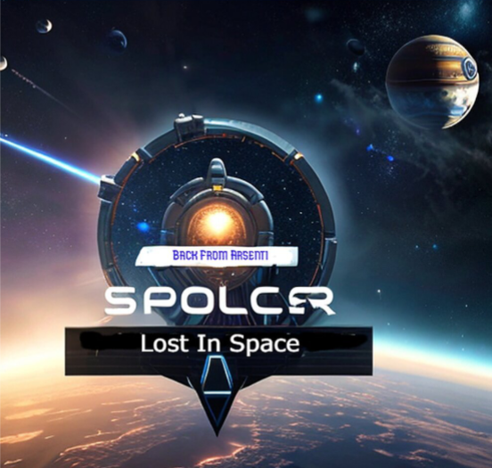
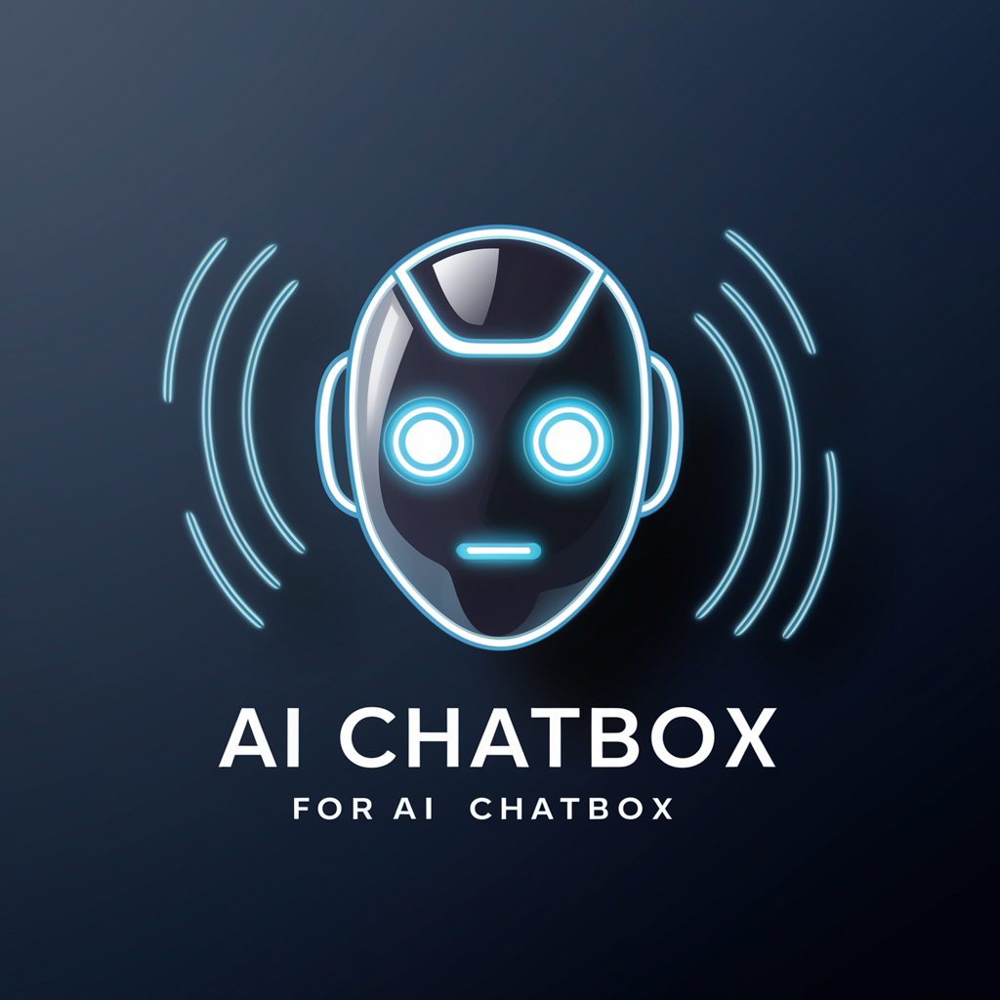
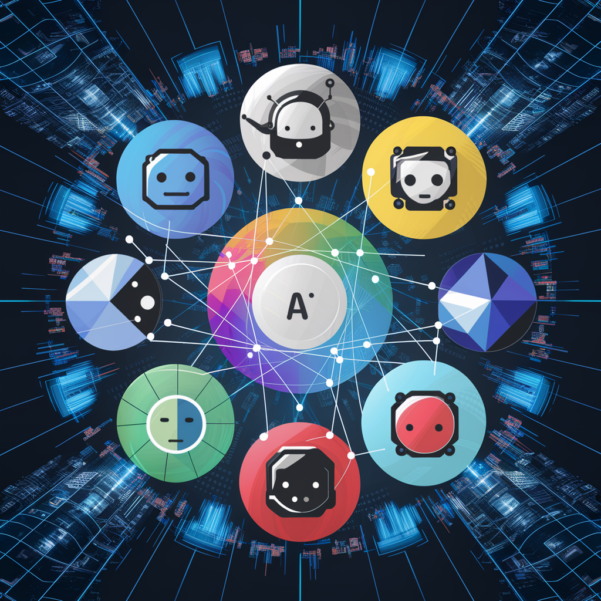
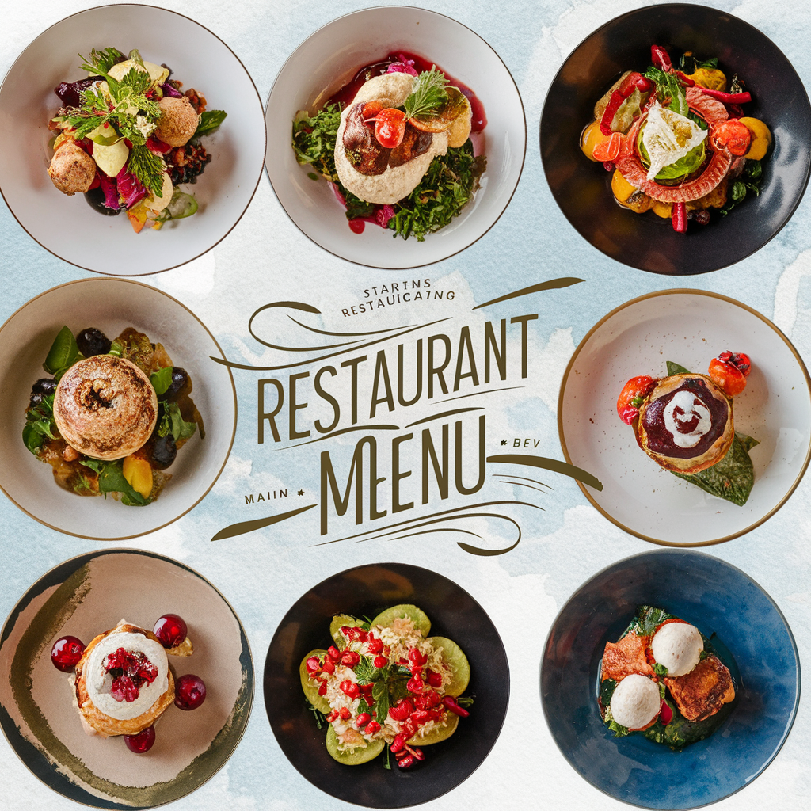
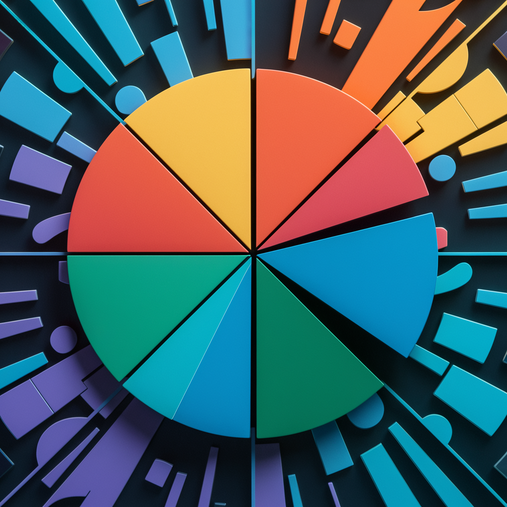
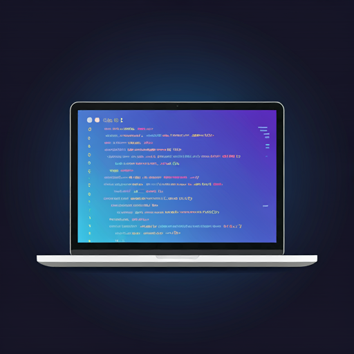

<div align="center">

# 🚀 Programming Portfolio Showcase

**A modern, interactive web portfolio spanning machine learning, game development, and AI applications.**

[](https://programming-showcase-new.vercel.app)
[](https://nextjs.org/)
[](https://react.dev/)
[](https://www.typescriptlang.org/)
[](https://tailwindcss.com/)

[**🌐 View the Live Site →**](https://programming-showcase-new.vercel.app)

</div>

---

## ✨ Highlights

- ⚡ **Built on Next.js 16 + React 19** with the App Router and Turbopack
- 🤖 **Live AI chat** — integrated with both Google Gemini and Anthropic Claude
- 🎨 **Fully responsive** UI styled with Tailwind CSS and custom Geist fonts
- 📊 **Analytics-ready** via Vercel Analytics
- 🧩 **Six real projects** across games, ML research, and full-stack apps

---

## 🗂️ Featured Projects

<table>
  <tr>
    <td width="50%" valign="top">
      <h3>🛸 Lost in Space</h3>
      <br/>
      A 2-D space exploration game with infinite exploration, multiple weapon systems, and power-ups.<br/><br/>
      <b>Stack:</b> C++<br/>
      <a href="https://github.com/TomHM31/LostinSpace">→ View Project</a>
    </td>
    <td width="50%" valign="top">
      <h3>💬 AI Chatbox</h3>
      <br/>
      A Gemini-powered chat interface with context-aware responses and custom prompt engineering.<br/><br/>
      <b>Stack:</b> Next.js · TypeScript · Gemini<br/>
      <a href="https://github.com/TomHM31/AI-Chatbox">→ View Project</a>
    </td>
  </tr>
  <tr>
    <td width="50%" valign="top">
      <h3>🧠 Multi-Agent Game Generator</h3>
      <br/>
      Advanced multi-agent environment generation for automated game creation.<br/><br/>
      <b>Stack:</b> Python · CrewAI · Gemini<br/>
      <a href="https://github.com/TomHM31/Multi-Agent-Game-Generator">→ View Project</a>
    </td>
    <td width="50%" valign="top">
      <h3>🍽️ Restaurant Menu — Full Stack</h3>
      <br/>
      A full-stack restaurant menu application with a relational backend and REST API.<br/><br/>
      <b>Stack:</b> React · Java Spring · PostgreSQL<br/>
      <a href="https://github.com/TomHM31/Restaurant-Menu-FullStack">→ View Project</a>
    </td>
  </tr>
  <tr>
    <td width="50%" valign="top">
      <h3>📈 xDeepFM Replication</h3>
      <br/>
      A research-paper replication of xDeepFM for recommender systems, with hyperparameter-tuning experiments.<br/><br/>
      <b>Stack:</b> Python<br/>
      <a href="https://github.com/TomHM31/xDeepFM-Replication">→ View Project</a>
    </td>
    <td width="50%" valign="top">
      <h3>🔬 Develop ML Solution</h3>
      <br/>
      A deep-learning pipeline covering feature engineering, model training, and optimization.<br/><br/>
      <b>Stack:</b> Python<br/>
      <a href="https://github.com/TomHM31/Develop-ML">→ View Project</a>
    </td>
  </tr>
</table>

---

## 🛠️ Tech Stack

**Framework & Frontend**


**AI & Backend**


**Languages across projects**


---

## 📦 Getting Started

```bash
# 1. Clone the repository
git clone https://github.com/TomHM31/Programming-Showcase.git
cd Programming-Showcase

# 2. Install dependencies
npm install

# 3. Add environment variables (see below), then run the dev server
npm run dev
```

Open [http://localhost:3000](http://localhost:3000) in your browser.

### 🔑 Environment Variables

Create a `.env.local` file in the project root:

```bash
# AI API keys (for the chat feature)
GEMINI_API_KEY=your_gemini_key
ANTHROPIC_API_KEY=your_claude_key

# Optional author info (falls back to defaults if omitted)
NEXT_PUBLIC_AUTHOR_NAME=Your Name
NEXT_PUBLIC_AUTHOR_EMAIL=you@example.com
```

---

## 🖥️ Scripts

| Command | Description |
| :--- | :--- |
| `npm run dev` | Start the development server |
| `npm run build` | Create an optimized production build |
| `npm run start` | Run the production server |
| `npm run lint` | Lint the codebase |

---

## 🚀 Deployment

Deployed on **Vercel** with automatic builds on every push to `main`.

🔗 **Live:** [programming-showcase-new.vercel.app](https://programming-showcase-new.vercel.app)

---

## 📫 Contact

[](mailto:hoangminhkhoi3108@gmail.com)
[](https://www.linkedin.com/in/tom-hoang3108/)
[](https://github.com/TomHM31)

---

## 📝 License

For each replicated or research-based project, please always refer to the original author.

<div align="center">

⭐ *If you like this portfolio, consider giving it a star!*

</div>
